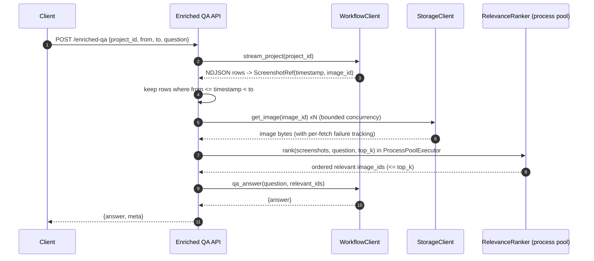

# Architecture: Enriched QA Service

This document captures the proposed architecture for the Mimica Python Engineer (ML) challenge. It is intended to be iterated on before any code is written.

---

## 1. Goals and Non-Goals

### Goals

- Async REST endpoint that accepts `{project_id, from, to, question}` and returns an answer enriched with relevant screenshots.
- Swappable integrations: the Workflow Services client, the screenshot storage client, and the relevance ranker are each defined as a port (Protocol). The core orchestration imports only these ports.
- Safe handling of CPU-bound relevance work so the event loop is not blocked under burst load.
- OpenTelemetry-compatible observability: a few meaningful spans, a handful of metrics, and structured logs with a propagated request ID.
- Fully testable without touching any live external service.

### Non-Goals

- No real ML model. The relevance ranker is a deterministic fake that preserves the CPU-bound shape.
- No real S3/GCS connectivity. A cloud adapter is sketched but not wired to a real bucket.
- No production deployment, autoscaling, or secrets management beyond env vars.
- No authentication, rate limiting, or streaming response.

---

## 2. High-Level Flow



---

## 3. Domain Model

A single shared type avoids naming drift between the upstream wire format and the internal pipeline.

```python
@dataclass(frozen=True)
class ScreenshotRef:
    timestamp: int   # unix seconds
    image_id: str    # stable identifier used by storage and QA
```

The Workflow Services adapter is responsible for mapping the upstream `screenshot_url` field onto `image_id`. The QA endpoint and storage endpoint both use `image_id` (the upstream spec calls the same value an "Image Identifier" in the description, despite the `screenshot_url` field name). Nothing else in the code should know about `screenshot_url`.

---

## 4. Stream Assumptions

The upstream `/projects/{projectId}/stream` endpoint takes no time parameters. We must therefore be explicit about how we consume it:

- **Assumption: the stream is finite and sorted by `timestamp` ascending.** If this holds, we can stop reading as soon as we see `timestamp >= to`, bounding work per request.
- The assumption is toggleable via the `ASSUME_SORTED_STREAM` config flag (default `True`). Setting it to `False` makes the orchestrator drain to EOF, constrained by the overall request budget. A request that does not complete within `REQUEST_TIMEOUT_MS` returns `504`.
- Window semantics: `[from, to)` — inclusive at `from`, exclusive at `to`. Documented in the OpenAPI response and the error message for out-of-window empty results.
- Malformed NDJSON lines are logged and skipped at the **Workflow HTTP adapter**; the orchestrator never sees raw lines. Tests for this behaviour live at the adapter layer.

This assumption is called out in `README.md` so an evaluator can challenge it.

---

## 5. Component Boundaries (Ports and Adapters)

All core dependencies are expressed as `typing.Protocol`s in `app/ports/`. Concrete implementations live in `app/adapters/`. The core orchestrator depends only on the ports.

### `WorkflowServicesClient`

```python
class WorkflowServicesClient(Protocol):
    def stream_project(self, project_id: UUID) -> AsyncIterator[ScreenshotRef]: ...
    async def qa_answer(self, question: str, relevant_images: list[str]) -> str: ...
```

- `stream_project` returns an async iterator so NDJSON rows are consumed as they arrive.
- `qa_answer` returns the upstream `answer` field directly as a `str`. No `Answer` wrapper — the value is a string already.
- The HTTP adapter maps the upstream `screenshot_url` field onto `ScreenshotRef.image_id`.
- Transport or 5xx failures raise `WorkflowUpstreamError`; malformed NDJSON lines are logged and skipped inside the adapter.

### `ScreenshotStorageClient`

```python
class ScreenshotStorageClient(Protocol):
    async def get_image(self, image_id: str) -> bytes: ...
```

- Single-image granularity keeps the interface small. Batch fetching is done by the orchestrator with bounded concurrency.

### `RelevanceRanker`

```python
class RelevanceRanker(Protocol):
    async def rank(
        self,
        screenshots: list[ScreenshotWithBytes],
        question: str,
        top_k: int,
    ) -> list[str]: ...
```

- `ScreenshotWithBytes(ref: ScreenshotRef, data: bytes)` — the wrapped `ref` keeps the timestamp available to the ranker, and keeps `ScreenshotRef` (the type flowing through the pipeline before fetch) as the thing sampling operates on. See `plan.md` Phase 4 pre-fetch sampling.
- Returns at most `top_k` `image_id`s, **ordered most relevant first**.
- "Most relevant" is a ranking problem, not a boolean filter. The default `top_k` is configurable via `MAX_RELEVANT_IMAGES` (default 20).
- Implementation routes the CPU work through `loop.run_in_executor(ProcessPoolExecutor, ...)`. Callers never see the executor.

---

## 6. Concurrency and Back-Pressure

Under the stated burst (up to 10 concurrent requests, each up to 500 images), per-request caps are not enough. We need three layers:

- **Per-request semaphore** on image fetches (default 25). Stops a single request from monopolising the pool.
- **Process-wide storage semaphore** (default 100). Caps total concurrent storage calls across all in-flight requests.
- **`httpx.Limits`** on the shared `AsyncClient`: `max_connections=100`, `max_keepalive_connections=50`. The transport-level cap matches the application-level cap so neither silently becomes the bottleneck.

Additional rules:

- NDJSON is parsed line-by-line via `aiter_lines()`; rows outside `[from, to)` are dropped without ever holding the full response.
- One process-wide `ProcessPoolExecutor` sized to `os.cpu_count()` handles ranking. Worker recycling (`max_tasks_per_child`) is production hardening and deferred for this challenge.
- Ranker input is capped (`MAX_RANK_INPUT`, default 500). Sampling happens on the `list[ScreenshotRef]` **before** fetch (see `plan.md` Phase 4), not after — so timestamps are still present and we avoid fetching images we'd immediately discard. Sampling is uniform over the `[from, to)` window. This is a pragmatic choice for this challenge — pickling 500 image blobs into a worker is not free, and the real system would co-locate or stream bytes differently.
- Every outbound hop has an explicit timeout. An overall request budget is enforced at the handler via `asyncio.timeout(...)`. Note: `asyncio.timeout` cancels the awaiting coroutine but cannot kill in-flight CPU work inside a worker process; bounding input size is what keeps ranker cost predictable.

---

## 7. Request and Response Format

This resolves the brief's ambiguity on response shape.

### Request

```json
{
  "project_id": "8b80353b-aee6-4835-ba7e-c3b79010bc0b",
  "from": 1754037000,
  "to": 1754039000,
  "question": "What car license plates are being looked at?"
}
```

`from` is a Python keyword, so the Pydantic model declares it with an alias:

```python
class EnrichedQARequest(BaseModel):
    project_id: UUID
    from_: int = Field(alias="from", ge=0)
    to: int = Field(ge=0)
    question: str = Field(min_length=1, max_length=1024)

    @model_validator(mode="after")
    def _validate_window(self) -> "EnrichedQARequest":
        if self.from_ >= self.to:
            raise ValueError("'from' must be strictly less than 'to'")
        return self
```

### Success Response

```json
{
  "answer": "The license plates visible are ABC-123 and XYZ-789.",
  "meta": {
    "request_id": "a3f2...",
    "images_considered": 312,
    "images_relevant": 14,
    "errors": {
      "storage_fetch_failed": 3
    },
    "latency_ms": {
      "stream": 120,
      "fetch": 430,
      "rank": 210,
      "qa": 180,
      "total": 940
    }
  }
}
```

### Error Response

A small, consistent error envelope — no RFC 7807 ceremony:

```json
{
  "error": "workflow_upstream_timeout",
  "detail": "Workflow Services stream did not respond within 5000ms.",
  "request_id": "a3f2..."
}
```

Status codes: `400` for validation, `502` for upstream failure or excessive partial failures (see §8), `504` for total-budget timeout, `500` for unexpected errors.

---

## 8. Partial Failure Policy

Silent data loss in a QA context produces confidently wrong answers. The policy is explicit:

- Each storage fetch that fails (404, timeout, 5xx) is recorded but does not abort the request. The adapter raises `StorageFetchError`; the orchestrator catches it and increments a counter.
- Failures are counted and exposed in `meta.errors` (e.g. `storage_fetch_failed: 3`).
- **Fail-fast threshold:** if `total_fetches > 0` *and* `failed / total_fetches > MAX_FETCH_FAILURE_RATIO` (default 0.2), the orchestrator raises `PartialFailureThresholdExceededError` and the request returns `502`. The `total > 0` guard is essential — without it, an empty window would divide by zero.
- **Empty-window short-circuit:** if zero screenshots remain in `[from, to)` after streaming, return `200` with `answer: ""`, `images_considered: 0`, empty `errors`, and **skip fetch, rank, and QA entirely**. This is the same path that makes the threshold safe (nothing to divide, nothing to fail).

---

## 9. Mock Separable Services

Both mocks live under `mock_services/` and are runnable standalone. The brief explicitly asks for S3 storage to be mocked as an async-compatible separable service, so `mock_services/storage_api/` is a real FastAPI app on its own port — not an in-process fake.

### `mock_services/workflow_api/` (port 9000)

- `/projects/{id}/stream` yields NDJSON with a realistic cadence so streaming logic is genuinely exercised.
- `/qa/answer` returns a deterministic answer built from the question and the image IDs passed in, so assertions are stable.

### `mock_services/storage_api/` (port 9100)

- Single route: `GET /images/{image_id}` returning deterministic bytes (e.g. `f"fake-image::{image_id}".encode()`).
- The production `StorageClient` adapter targets the same HTTP surface via `STORAGE_BASE_URL`. Swapping to real GCS/S3 is a config + adapter change, not a core change.
- A lightweight in-process implementation of the `ScreenshotStorageClient` Protocol still exists for fast unit tests that do not need the HTTP surface.

Both services are launched via a single `make run-mocks` target (or `python -m mock_services.<name>`).

---

## 10. Observability

- OpenTelemetry SDK initialised at app startup. FastAPI and httpx auto-instrumented.
- Spans (one per logical step): `enriched_qa.handler`, `workflow.stream`, `storage.fetch_batch`, `relevance.rank`, `workflow.qa_answer`.
- Metrics: request count, request-duration histogram (label: outcome), `images_considered`, `images_relevant`, `storage_fetch_failed`, rank-duration histogram.
- Structured JSON logs via `structlog`. A middleware generates a `request_id` and binds it to the logger + current span for correlation.
- OTLP exporter endpoint is configurable via `OTEL_EXPORTER_OTLP_ENDPOINT`. Dev default is the console exporter to keep local runs self-contained.

---

## 11. Configuration

Env vars read via `pydantic-settings`:

| Variable                      | Default                  | Purpose                                            |
|-------------------------------|--------------------------|----------------------------------------------------|
| `WORKFLOW_API_URL`            | `http://localhost:9000`  | Base URL for Workflow Services API.                |
| `STORAGE_BASE_URL`            | `http://localhost:9100`  | Base URL for mock S3-compatible storage service.   |
| `STORAGE_BUCKET`              | `mimica-screenshots`     | Logical bucket name (for log/span attributes).     |
| `MAX_CONCURRENT_FETCHES`      | `25`                     | Per-request storage concurrency.                   |
| `GLOBAL_FETCH_CONCURRENCY`    | `100`                    | Process-wide storage concurrency.                  |
| `MAX_RELEVANT_IMAGES`         | `20`                     | Top-K cap for relevance ranker output.             |
| `MAX_RANK_INPUT`              | `500`                    | Ranker input cap; oversampled sets are downsampled.|
| `MAX_FETCH_FAILURE_RATIO`     | `0.2`                    | Partial-failure threshold before 502.              |
| `ASSUME_SORTED_STREAM`        | `true`                   | If true, stop reading the stream at `timestamp >= to`. If false, drain to EOF. |
| `FILTER_WORKERS`              | `os.cpu_count()`         | Process pool size.                                 |
| `REQUEST_TIMEOUT_MS`          | `15000`                  | Total per-request budget.                          |
| `OTEL_EXPORTER_OTLP_ENDPOINT` | (unset -> console)       | OTLP destination.                                  |

Adapters are constructed once at startup. `app/deps.py` exposes FastAPI dependency providers that return the active instances. Tests override them via `app.dependency_overrides`.

---

## 12. Testing Strategy

Tests are derived from the contract (signatures, this architecture), not by mirroring implementation code.

Tests are split by layer to keep each suite honest about what it owns (see `plan.md` Phase 8 for the full matrix):

### Orchestrator unit tests (Protocol fakes only)

- Empty stream / empty window (`images_considered == 0`, 200 with empty answer, **no calls to storage/ranker/QA**).
- Zero rows in `[from, to)` (all before `from` or at/after `to`) — same behaviour as empty stream.
- Boundary inclusivity: `timestamp == from` included, `timestamp == to` excluded.
- Sorted-stream short-circuit triggers under `ASSUME_SORTED_STREAM=True`; drains to EOF under `False`.
- Storage 404s below threshold: dropped, counted in `meta.errors`, request succeeds.
- Storage failures above threshold: `PartialFailureThresholdExceededError` → 502.
- Orchestrator propagates `WorkflowUpstreamError` unchanged (the 5xx→error mapping is the adapter's job, tested there).
- Ranker returns IDs in a known order; orchestrator preserves that order when calling `qa_answer`.

### Adapter unit tests (`httpx.MockTransport`)

- Workflow: malformed NDJSON line skipped; subsequent valid rows still yielded.
- Workflow: upstream `screenshot_url` maps to `ScreenshotRef.image_id`.
- Workflow: non-2xx (including 5xx) → `WorkflowUpstreamError`.
- Storage: 404 / 5xx / timeout → `StorageFetchError`.

### Wire-up tests (FastAPI TestClient + `dependency_overrides`)

- POST with literal `"from"` body key returns 200 (alias round-trip).
- POST with `from == to` returns 400 (handler overrides FastAPI's default 422).
- `PartialFailureThresholdExceededError` maps to 502.

### Concurrency / capacity

- Huge image count (500): peak concurrency stays bounded; semaphore does not deadlock.

### Integration Tests

- Spin up `mock_services.workflow_api` and `mock_services.storage_api` in pytest fixtures, point the real `httpx` adapters at them, assert end-to-end behaviour.
- Assert `images_considered` matches stream filtering and `images_relevant <= MAX_RELEVANT_IMAGES`.

### CPU-Bound Ranker Tests

- Verify the ranker actually runs in a child process (`multiprocessing.current_process().name != "MainProcess"` inside the CPU function, observed via a test hook). Event-loop lag measurement is more rigorous but overkill for this challenge and is deferred (see `plan.md`).
- Verify output is deterministic and ordered for a given input and question.

### Burst / Concurrency Tests

- Fire N concurrent requests against the app with mocks; assert p95 latency stays bounded and the process-wide semaphore caps total peak storage concurrency.

---

## 13. Project Layout

```
app/
  main.py
  api/
    routes.py
    schemas.py
  core/
    orchestrator.py
    models.py           # ScreenshotRef, ScreenshotWithBytes
  ports/
    workflow.py
    storage.py
    relevance.py
  adapters/
    workflow_http.py
    storage_http.py     # targets STORAGE_BASE_URL
    storage_fake.py     # in-process fake for unit tests
    relevance_cpu.py
  observability/
    tracing.py
    logging.py
    middleware.py
  config.py
  deps.py
mock_services/
  workflow_api/
    app.py
    __main__.py
  storage_api/
    app.py
    __main__.py
tests/
  unit/
  integration/
  conftest.py
pyproject.toml
Makefile
README.md
```

---

## 14. Open Questions

1. **Stream ordering guarantee.** The plan assumes upstream NDJSON is sorted ascending by timestamp so we can short-circuit at `timestamp >= to`. Is that guaranteed, or should we always drain to EOF?
2. **Partial-failure threshold.** 20% failed fetches -> 502 is a starting point. Is there a product-level expectation (e.g. always answer with whatever we have, or always fail if any image is missing)?
3. **Top-K default.** `MAX_RELEVANT_IMAGES = 20` is a guess. What does the downstream QA endpoint expect as a reasonable upper bound?
