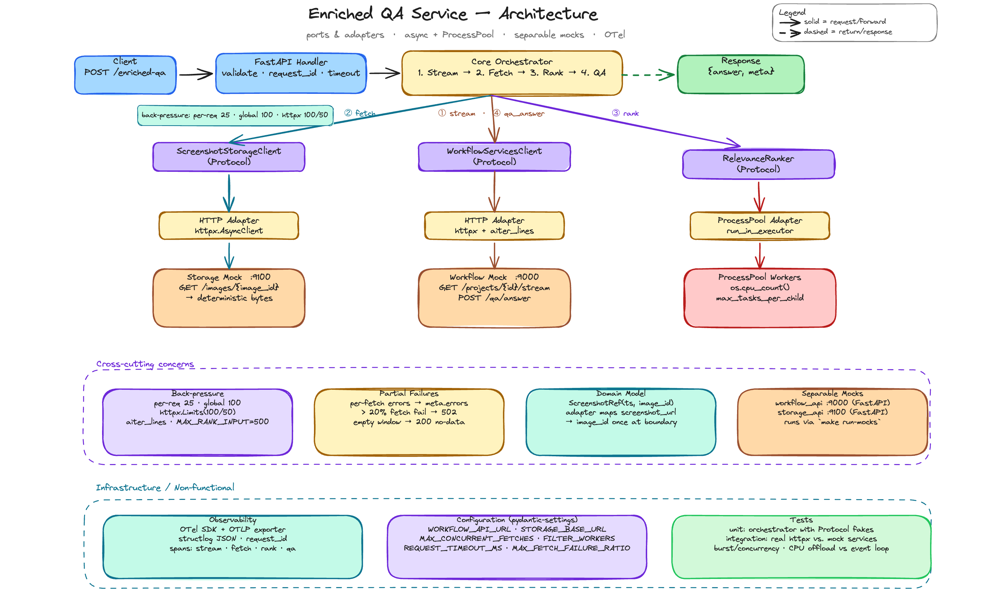
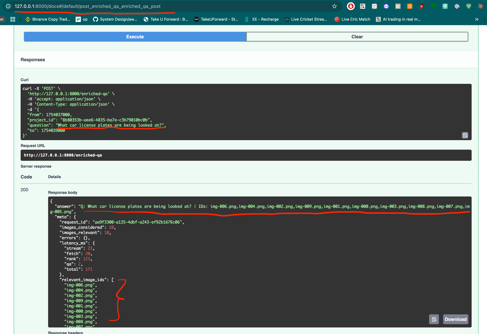

# Enriched QA Service

Async REST service that enriches a question-answering endpoint with relevant
screenshots sourced from a project's time window. The service streams image
references from an upstream workflow API, fetches the associated binary data
from object storage in parallel, ranks them for relevance using a CPU-bound
worker pool, and forwards the shortlisted identifiers to a QA backend — all
within a single request lifetime.

## [architectecture_diagram](docs/2_architecture_diagram.excalidraw)



## Quickstart

Python 3.12 required. Dependencies are managed with
[`uv`](https://docs.astral.sh/uv/).

If reviewing from GitHub instead of a zip archive:

```bash
git clone <github-repository-url>
cd mimicaai-assignment
```

### Option 1: local setup with `uv`

Install [`uv`](https://docs.astral.sh/uv/getting-started/installation/) first,
then run:

```bash
make install   # uv sync — installs all dependencies into .venv
```

You do not need to create or activate a virtual environment manually; `uv`
creates the project-local `.venv` automatically. If you prefer not to activate
it, every project command already uses `uv run ...` through the Makefile.

### Option 2: containerized setup with Docker Compose

If you want a toolchain-independent path, build and run the full stack with
Docker:

```bash
docker compose up --build
```

This starts:

- the app on <http://localhost:8000>
- the workflow mock on <http://localhost:9000>
- the storage mock on <http://localhost:9100>

Compose also assigns explicit container names so the running stack is easy to
inspect:

- `mimicaai-app`
- `mimicaai-workflow-mock`
- `mimicaai-storage-mock`

You can stop the stack with:

```bash
docker compose down
```

## Running the live stack

```bash
# Terminal 1 — workflow mock (:9000) and storage mock (:9100)
make run-mocks

# Terminal 2 — the enriched-qa service (:8000)
make run
```

Then POST to `/enriched-qa`. The payload below is the exact example
from the assignment brief (`docs/1_assignment.md`) and is also the
default pre-filled in Swagger at <http://localhost:8000/docs>:



The mock workflow QA endpoint echoes the question and the ranked image
ids verbatim so a reviewer can verify the ranker's output order
end-to-end. A real QA backend would return a natural-language answer
in the same `answer` field — the orchestrator passes it through
unchanged. `meta.relevant_image_ids` exposes the ranker's selection as
a machine-parseable list so clients don't have to parse the free-form
`answer` to recover it.

### Swagger UI

FastAPI's interactive docs are available at
<http://localhost:8000/docs> while the service is running. The
`POST /enriched-qa` operation pre-fills the Try-It-Out body with the
assignment's canonical payload, so a reviewer can click **Try it
out → Execute** and land inside the mock stream with no edits.
ReDoc is also served at <http://localhost:8000/redoc>.

The upstream URLs are configurable via `WORKFLOW_API_URL` and
`STORAGE_BASE_URL` — see `.env.example`. Mock ports can be overridden via
`WORKFLOW_PORT` / `STORAGE_PORT` before `make run-mocks`.


### Testing against the assignment criteria

| Assignment criterion | How it is covered |
|---|---|
| REST service accepts project/time-window/question input | `tests/unit/test_schemas.py` validates the request body, aliases the wire field `from` to `from_`, enforces `from < to`, and rejects invalid UUIDs or empty questions. `tests/unit/test_routes.py` verifies FastAPI accepts the literal assignment payload shape. |
| Workflow API NDJSON stream is consumed asynchronously | `tests/unit/test_workflow_http.py` exercises streaming with `httpx.MockTransport`, including valid rows, malformed rows, missing fields, and non-2xx/transport failures. |
| Images are retrieved from an async, separable storage service | `mock_services/storage_api` is a standalone FastAPI service. `tests/unit/test_storage_http.py` verifies async HTTP fetching, URL-safe image identifiers, error translation, and process-wide concurrency limiting. |
| Relevance filtering is CPU-intensive and swappable | `app/ports/relevance.py` defines the ranker Protocol. `tests/unit/test_relevance_cpu.py` proves the concrete ranker dispatches work through a `ProcessPoolExecutor`; `tests/unit/test_relevance_fake.py` covers the deterministic fake used in fast unit tests. |
| Core service does not depend on concrete clients | `tests/unit/test_ports.py` and `tests/unit/test_deps.py` verify the Protocol/fake wiring. The orchestrator tests use only the `Ports` bundle, not HTTP implementations. |
| Correct end-to-end flow: stream → filter → fetch → rank → QA | `tests/unit/test_orchestrator.py` covers the core pipeline, empty-window short-circuit, `[from, to)` boundary behavior, sorted-stream assumption, partial-failure threshold, sampling before fetch, order preservation, and concurrency bounds. |
| Workflow `/qa/answer` receives ranked image identifiers | `tests/unit/test_workflow_http.py` verifies the POST body. `tests/unit/test_orchestrator.py::TestOrderPreservation` verifies ranker order is passed to QA unchanged. |
| Observability is appropriate for production-style debugging | `tests/unit/test_obs_middleware.py`, `tests/unit/test_obs_logging.py`, `tests/unit/test_obs_tracing.py`, and `tests/unit/test_orchestrator_spans.py` cover request-id propagation, structured logs, tracing configuration, and manual pipeline spans. |
| The stack can be tested without external paid services | `tests/integration/test_end_to_end.py` runs the app with in-process ASGI mocks. `tests/integration/test_live_stack.py` starts the app and both mock services as real `uvicorn` subprocesses over TCP. |
| Reviewers can run the stack without local Python toolchain setup | Root `Dockerfile` and `compose.yaml` provide a containerized app + mock stack on ports `8000`, `9000`, and `9100`. `tests/unit/test_container_files.py` guards the presence and wiring of those container artifacts. |
| Quality gates are reproducible by reviewers | `make test`, `make test-cov`, `make lint`, and `make typecheck` are the reviewer entry points. The coverage gate is configured at 93% branch coverage. |


### Troubleshooting: mocks not running

Running the app without the mocks produces a **502 `workflow_upstream_failure`**:

```json
{
  "error": "workflow_upstream_failure",
  "detail": "Workflow Services API request failed.",
  "request_id": "<uuid>"
}
```

This shape confirms that routing, request-id correlation, and the error envelope
are all wired correctly — only the upstream is absent. Start `make run-mocks`
and retry.

## Unit Testing

```bash
make test       # full suite
make test-cov   # same, with the 93% branch-coverage gate enforced
```

Run individual layers:

```bash
uv run pytest tests/unit/test_orchestrator.py -v       # core pipeline
uv run pytest tests/unit/test_workflow_http.py -v      # HTTP adapter
uv run pytest tests/unit/test_storage_http.py -v       # HTTP adapter
uv run pytest tests/unit/test_routes.py -v             # FastAPI wire-up
uv run pytest tests/unit/test_boundary_contracts.py    # timeout, request-id, sanitisation
uv run pytest tests/unit/test_container_files.py       # Dockerfile + compose regression checks
uv run pytest tests/integration/test_end_to_end.py     # component-level, ASGITransport
uv run pytest tests/integration/test_live_stack.py     # real sockets + subprocess mocks
```

The integration suite has two layers:

- `test_end_to_end.py` uses `httpx.ASGITransport` for fast component-level
  coverage of encoding, partial-failure handling, and order preservation.
- `test_live_stack.py` spawns the mocks and the app as real `uvicorn`
  subprocesses on ephemeral ports, exercising the full production wiring —
  shared `httpx.AsyncClient` lifespan, `build_http_ports`, and TCP between
  every hop. One case pipes app stdout to a file and asserts a JSON log line
  carrying the inbound `X-Request-Id` is present, proving the observability
  pipeline is wired end-to-end.

The latest local verification before submission was:

```text
make test       -> 334 passed
make test-cov   -> 334 passed, 99.59% coverage
make lint       -> ruff + flake8 passed
make typecheck  -> mypy passed
```

`make install` does not install git hooks, so it works from a zipped
submission without a `.git` directory.


## Observability

| Config | Effect |
|---|---|
| `OTEL_EXPORTER_OTLP_ENDPOINT=https://collector:4317` | Ship spans over OTLP/gRPC |
| `TRACE_CONSOLE=true` | Print spans to stdout (console exporter) |
| Neither set | No-op exporter; stdout is JSON logs only |

The service name on every OTel resource is `enriched-qa-service`.

**Spans** — five manual spans nest under the auto-instrumented FastAPI server
span. Each span carries `project_id`, `images_considered`, `images_relevant`,
and `fetches.failed` as attributes, populated eagerly so dashboards see counts
even when a request fails mid-pipeline.

**Logs** — one JSON object per line: `event`, `level`, `timestamp` (ISO-8601
UTC), plus bound contextvars and any handler-supplied fields. Stdlib loggers
from uvicorn and httpx are routed through the same structlog pipeline via
`ProcessorFormatter`, so no log line bypasses request-id correlation.

## Features

- **Request correlation** — inbound `X-Request-Id` is honoured or a UUID4 is
  minted; the id propagates through response headers, the response body, every
  log line, and the active OpenTelemetry span.
- **Structured logging** — all output is newline-delimited JSON
  (`event`, `level`, `timestamp`, `request_id`, plus any handler-bound fields).
  Stdlib loggers (uvicorn, httpx) are routed through the same structlog
  pipeline so no log line is plain text.
- **Distributed tracing** — five manual spans (`enriched_qa.handler`,
  `workflow.stream`, `storage.fetch_batch`, `relevance.rank`,
  `workflow.qa_answer`) nest under the auto-instrumented FastAPI server span;
  `httpx` client spans are attached automatically for every upstream call.
- **Process-pool ranker** — relevance ranking runs on a
  lifespan-managed `ProcessPoolExecutor` to keep the async event loop free;
  pool failure surfaces as HTTP 503 (`relevance_ranker_unavailable`).
- **Graceful error envelopes** — all error responses share a consistent shape
  (`error`, `detail`, `request_id`) and timeouts, upstream failures, and
  validation errors each map to a distinct error code.

## Architecture

```
POST /enriched-qa
    └── RequestIdMiddleware (bind request_id)
        └── enriched_qa.handler span
            ├── workflow.stream   — NDJSON stream of image refs
            ├── storage.fetch_batch — parallel binary fetches
            ├── relevance.rank   — CPU-bound worker pool
            └── workflow.qa_answer — QA call with ranked ids
```

For a full design walkthrough see [architect.md](docs/2_architectecture.md).
The historical implementation decision log lives in
[implementation_notes.md](docs/4_implementation_notes.md) - kept as the
build record; `app/` is the source of truth.
